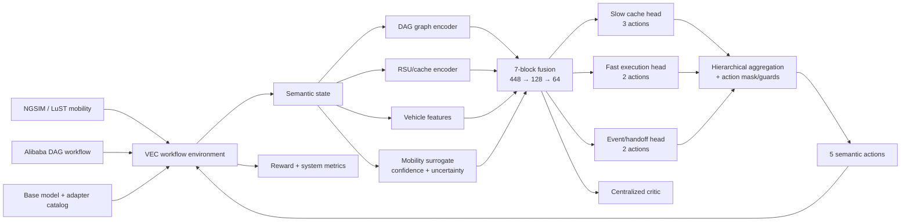

# PPO_MEC 导师汇报讲稿

- `prepared_at`: `2026-06-21`
- `evidence_cutoff`: `2026-06-18`
- `artifact_run_id`: `final_submission_v7_latency_fallback_20260618_rebuild_v1`
- `evidence_level`: `E3_REPRODUCED`
- `reviewer_status`: `Not TMC-ready`

## 一句话版本

本研究面向车辆跨 RSU 移动时的连续 AI 工作流执行问题，把 DAG 任务依赖、路侧 adapter cache、车辆移动/切换预测和 handoff 状态迁移放进同一个决策过程，并用预测辅助的图结构多时间尺度 PPO，在“缓存准备—实时卸载—切换迁移”三个时间尺度上协同控制。

## 建议的汇报主线

不要从 PPO 公式开始。按下面四句话展开：

1. **问题是什么：** 车辆上的 AI 工作流不是单个任务，而是有前后依赖的 DAG；车辆移动跨 RSU 后，下一节点还要继续执行，同时所需 adapter 和中间状态可能不在新 RSU。
2. **为什么难：** 缓存放置是慢决策，任务卸载是快决策，handoff prepare 是事件决策；三者使用同一份移动预测，但时间尺度、合法动作和代价不同。
3. **怎么解决：** 用图编码器表示 DAG 与执行 frontier，用 RSU/cache 编码器表示当前和目标边缘状态，用带置信度/不确定性的 surrogate 分支表示未来移动，再由 slow/fast/event 三个 actor head 和 centralized critic 联合训练。
4. **做到什么程度：** 模型和 legacy 实验已完整复现；严格非重叠评估中，mixed formal/holdout 对最强 learned baseline 的置信区间为正，但 full 场景置信区间仍跨 0，因此当前是“机制和系统链路已成立、严格顶刊证据仍需补强”，不能说已经 TMC-ready。

## 1. 问题定义

系统包含车辆、多个 RSU、车载 base model、RSU adapter cache，以及一个正在执行的 DAG workflow。每个 DAG 节点有输入/输出量、前驱/后继和所需 adapter。车辆移动会改变 associated RSU；控制器需要决定：

- 是否在当前 RSU 补齐 adapter；
- 是否向预测的下一 RSU 预取 adapter；
- 当前节点在车辆还是当前 RSU 执行；
- 是否为预测 handoff target 提前准备 adapter state migration。

优化目标不是单一 reward 的漂亮数字，而是联合改善 workflow completion/continuity、handoff failure、delay、cache warm hit、backhaul 和 migration overhead。

## 2. 可向老师陈述的创新点

### 创新点一：跨 RSU 连续 DAG workflow 与 adapter warm state 的联合问题建模

区别于只做“单任务卸载”、只做“service cache”或只做“handoff migration”，本项目把 DAG 执行进度、frontier、所需 adapter、当前/预测 RSU 的 warm state 和迁移准备放在同一状态—动作闭环中。真正要保持的是工作流跨 RSU 的连续执行，而不是某一个时刻的局部 reward。

### 创新点二：DAG—RSU—mobility surrogate 的可靠性门控融合表示

- DAGGraphEncoder：10 维节点特征、2 轮前驱/后继 message passing，输出 graph/current-node/frontier 三类 embedding。
- RSUStateEncoder：编码 RSU 集合、当前 RSU、预测下一 RSU/目标 RSU、cache、负载和 adapter demand。
- Mobility/surrogate branch：13 维预测特征，包括 next-RSU、handoff target、dwell time、future load、confidence、uncertainty、handoff countdown、边界压力和服务压力。
- prediction gate 使用 confidence、uncertainty 与 temporal urgency，降低低置信预测对策略的影响。

这部分的创新表述应是“可靠性门控的多源状态融合”，而不是“已训练了一个新移动预测器”。当前 predictor 是 baseline/calibrated interface，不是独立 learned surrogate checkpoint。

### 创新点三：面向异构时间尺度的层级三控制头 PPO

- slow head：`no_cache_change / current_rsu_cache_fill / predictive_next_rsu_prefetch`
- fast head：`current_rsu_offload / vehicle_fallback`
- event head：`keep / handoff_prepare`

slow head 的概率进入 fast head，slow+fast 的概率进入 event head，形成层级条件依赖。三个 head 共享 64 维融合表示与 centralized critic，但分别处理缓存、实时执行和切换事件。最终通过优先级聚合映射到固定 `semantic_discrete_5` 动作合同。

### 创新点四：预测切换机制的可兑现训练与安全约束

训练不仅优化 PPO surrogate objective，还对机制窗口进行 oversampling，并加入 prepare timing、event credit、mechanism auxiliary loss。推理侧使用 confidence/alignment admission、cache freshness、backhaul guard 和 latency fallback，防止低置信预取、过期 warm state 或不必要回传。

向老师说明：前三点是主要方法贡献；第四点中既有可学习的机制引导，也有 policy-side guard，论文必须分开写，不能把全部效果都归为纯端到端学习。

## 3. 整体模型框架

## 4. Model architecture 与参数

当前 seed-7 v7 checkpoint 共 `180,360` 个可训练参数：

| 模块 | 参数量 | 作用 |
|---|---:|---|
| SurrogateFusionEncoder | 146,048 | DAG、RSU、vehicle、prediction、continuity/reliability 融合 |
| Slow actor | 8,515 | cache placement/prefetch |
| Fast actor | 8,642 | RSU offload/vehicle fallback；输入含 slow probabilities |
| Event actor | 8,770 | keep/handoff prepare；输入含 slow+fast probabilities |
| Centralized critic | 8,385 | 共享 value estimation |

关键张量：

- 每个 DAG 节点 `10 → 64 → 64`，进行 2 次 dependency-aware message passing。
- 每个 RSU `10 → 64 → 64`。
- vehicle features `10 → 64 → 64`；prediction features `13 → 64 → 64`。
- 7 个 64 维 block 拼接为 `448` 维，经过 `448 → 128 → 64` shared fusion。
- actor/critic MLP 均为两层 64-unit Tanh 网络；fast 输入为 `64+3`，event 输入为 `64+3+2`。

## 5. 动作与奖励设计

最终环境动作固定为：

| ID | 动作 | 系统含义 |
|---:|---|---|
| 0 | `current_rsu_cache_fill` | 当前 RSU 缺 adapter 时反应式加载 |
| 1 | `predictive_next_rsu_prefetch` | 向预测下一 RSU 预取 adapter |
| 2 | `vehicle_fallback` | 当前节点回退到车辆本地执行 |
| 3 | `current_rsu_steady_offload` | 在当前 RSU 稳态卸载，不修改 cache |
| 4 | `handoff_migration_prepare` | 为预测 handoff target 准备状态迁移 |

层级聚合优先级是 event prepare → predictive prefetch → cache fill → vehicle fallback → steady offload。Action mask 会根据是否存在工作流节点、预测目标是否不同、目标 adapter 是否已就绪等前置条件屏蔽非法动作。

环境 reward 包含 service reward、continuity bonus、mechanism exploration bonus，并扣除 delay、cache miss 和 migration cost。汇报时必须同步展示 system metrics，避免把 reward shaping 当成机制兑现。

## 6. 数据与实验协议

| 项目 | 当前证据 |
|---|---|
| NGSIM mobility | `11,850,526` 条数据记录（CSV 约 2.0 GB） |
| Alibaba batch task | `14,295,731` 条记录（CSV 约 765 MB） |
| 可用 sampled DAG | 2,000 个候选中得到 `1,977` 个合法 DAG；5–15 tasks |
| External mobility | LuST FCD `183,493` 条记录；有效评估采用二维 `auto_grid_tight` RSU 布局 |
| Seeds | `7 / 13 / 29` |
| SA training | 每 seed 128 episodes、32 updates、6 training windows、2 workflows (`j_3`,`j_8`) |
| Learned baselines | PPO、MAPPO、DQN、Dueling-DQN、QMIX、Controller-MAT、DAG-Offload-DRL、Cache-Offload-DRL、DT-Handoff-DRL |
| Strict formal/holdout | 各 6 个 full windows，split 内和 split 间 frame interval 均无重叠 |

注意：原始 CSV 的总行数不等于训练样本数。模型训练和评估使用经过窗口扫描、DAG 解析和 workflow/window 组合后的 episode。

## 7. 当前最可靠的结果

严格非重叠协议，以当前最强 learned baseline `dt_handoff_drl` 为主比较：

| Split | SA | DT | SA − DT，95% CI | 判断 |
|---|---:|---:|---:|---|
| Formal mixed | 92.993 | 85.318 | `+7.676 [2.775, 13.402]` | CI 为正 |
| Formal full | 88.052 | 85.088 | `+2.964 [-0.203, 6.453]` | CI 跨 0 |
| Holdout mixed | 90.436 | 84.837 | `+5.599 [2.430, 9.186]` | CI 为正 |
| Holdout full | 85.732 | 84.468 | `+1.263 [-0.816, 3.513]` | CI 跨 0 |

需要主动说清楚两件事：

- SA 的 total reward 点估计在四个 split 都更高，但 full 的统计证据不够稳，不能说“四个场景均显著领先”。
- DT 在 full 场景的 continuity/failure 指标更好。例如 strict formal full 中 DT continuity `0.986`、failure `0.014`，SA 为 `0.898/0.086`。因此当前优势主要体现在综合 reward，不是每个系统指标全面占优。

## 8. 消融与外部迁移

3-seed formal 消融中，full method 相对变体的 total-reward delta：

| 移除组件 | Full − variant，95% CI |
|---|---:|
| latency fallback | `+0.422 [0.268, 0.580]` |
| prediction | `+10.847 [6.465, 15.024]` |
| hierarchy | `+13.176 [7.111, 19.228]` |
| event agent | `+8.127 [4.957, 11.117]` |
| adapter prefetch | `+10.503 [6.085, 14.696]` |

prediction 与 adapter-prefetch 的结果高度耦合，不能把两个 delta 相加，也不能宣称为完全正交贡献。

LuST + Alibaba external mobility：SA `94.054`，DT `88.222`，paired delta `+5.832 [4.424, 7.209]`；但 SA backhaul `101.333` 高于 popularity heuristic `90.667`。这证明模型可以迁移到另一类移动轨迹，但尚未证明所有资源指标都改善。

## 9. 三分钟口头稿

> 我的工作研究车辆跨 RSU 移动时，如何连续执行一个有依赖关系的 AI DAG 工作流。难点是每个节点需要不同 adapter，而车辆切换后，新 RSU 可能既没有 adapter，也没有上一节点的状态。现有工作经常把任务卸载、缓存和迁移分别优化，我把 DAG 执行状态、adapter warm state、移动预测和 handoff prepare 放进一个联合控制问题。
>
> 方法叫 SA-GHMAPPO。首先用图神经网络编码 DAG 的依赖、当前节点和可执行 frontier；再编码所有 RSU 的负载、cache 和目标 adapter；第三条分支输入 next-RSU、handoff target、dwell time、置信度和不确定性。七组 embedding 融合成 64 维共享状态。策略不是一个平面动作头，而是 slow、fast、event 三个 head：分别负责 cache/prefetch、RSU 或车辆执行，以及 handoff prepare。fast 依赖 slow 的分布，event 再依赖 slow 和 fast，centralized critic 用全局 continuity 与预测可靠性训练。
>
> 数据主线是 NGSIM mobility 和 Alibaba DAG；使用 3 个 seed，并和 9 个 learned baselines 比较。我们后来对评估做了严格复核，发现早期 offset holdout 与 formal 窗口有重叠，所以重新构造了时间不重叠的 formal/holdout。严格结果中，mixed formal 和 holdout 对最强 DT baseline 的 reward CI 为正；full 虽然点估计仍领先，但 CI 跨 0。因此我现在不会说已经达到顶刊水平，而是说框架、机制消融和外部 LuST 迁移已成立，下一步要用预冻结的 strict protocol 重训并补强 full 场景统计。

## 10. 老师可能追问的问题

### 这到底是不是 multi-agent？

当前是 controller-level multi-controller：slow/fast/event 三个控制头共享 encoder 和 centralized critic，不是“每辆车、每个 RSU 各自一个独立 agent”的 full MARL。论文中应使用 hierarchical multi-controller/centralized-critic 的精确定义。

### surrogate 是什么？是否训练了预测网络？

当前输入接口提供 next-RSU、handoff target、dwell/future load、confidence 和 uncertainty，并用 reliability gate 融合；尚未加载独立 learned predictor checkpoint。创新点在预测可靠性如何进入控制，不应声称发明了新的轨迹预测模型。

### 为什么 reward 更高，但 DT continuity 更好？

reward 综合了 service、delay、continuity、migration 等项。SA 更积极地使用 local fallback/placement action mix，因此综合 reward 提高；DT 在部分 full 窗口对 continuity/failure 更保守。论文必须同时报告 reward breakdown 和系统指标。

### 大量 guard 会不会说明模型没有真正学会？

这是合理质疑。应把 graph/hierarchical actor/critic 与 policy guards 分开做消融，并说明 guard 是安全约束还是性能来源。目前 latency fallback 的独立增益较小但 CI 为正；其他 guard 仍需要更细的拆分。

### 为什么只用 3 个 seed？

这是当前计算预算下的初步正式设置。已有 paired cluster bootstrap，但 strict full CI 不稳定；下一阶段应增加 seed、预冻结窗口和 multiplicity 策略，而不是继续在同一 holdout 上调参。

## 11. 向老师提出的下一步计划

1. 把 strict interval exclusion/non-overlap 直接并入 final-submission gate，冻结 formal/holdout 后再训练。
2. 针对 full 场景提升相对 DT 的 continuity/failure，而不是只优化综合 reward。
3. 增加 seeds，并使用层级 bootstrap 或 mixed-effects analysis，明确 multiple-comparison 校正。
4. 解耦 prediction 与 adapter-prefetch 消融，分开验证预测、缓存和迁移的独立作用。
5. 增加第二个 external mobility/workflow 组合，并报告 backhaul/latency/continuity trade-off。

## 证据入口

- 最新严格审计：`docs/project/top_journal_readiness_audit_20260618.md`
- v7 profile：`configs/experiment/top_journal_mechanism_v7_latency_fallback.yaml`
- 主模型：`src/agents/sa_ghmappo_agent.py`、`src/agents/sa_ghmappo_core.py`
- 融合编码器：`src/encoders/fusion_encoder.py`
- DAG/RSU encoder：`src/encoders/dag_graph_encoder.py`、`src/encoders/rsu_state_encoder.py`
- 动作合同：`src/envs/specs/action_schema.py`
- strict statistics：`artifacts/experiments/top_journal_final_submission/final_submission_v7_latency_fallback_20260618_rebuild_v1/learned_suites/nonoverlap_statistics_by_mode/`
