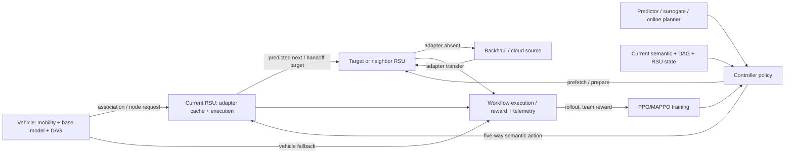

# PPO_MEC 全系统 Cache / Algorithm / Novelty 审计

- `reviewed_at`: `2026-08-14`
- `literature_cutoff`: `2026-08-14`
- `target_venue`: `IEEE TMC`（次级适配：IEEE TITS / TVT）
- `artifact_run_id`: `top_journal_v100_urgency_safe_resource_full_20260808`; `top_journal_v100_future_validation_v20_20260809`; `top_journal_v100_lust_future_validation_20260810`
- `policy_version`: `tmc_review_policy_v3_20260621`
- `git_commit_reviewed`: `2795d6aa2251be5e5f686a62bf52d85fd46cfdc3`
- `evidence_level`: `E2_ARTIFACT_AUDITED`（v100 formal/future 原始 rows、aggregate、statistics、integrity 可用）；本文新增的 LRU/LFU、byte-hit、oracle-cache 问题为 `E0_UNAVAILABLE`
- `verdict`: `Not TMC-ready`（无 untouched v100 hidden holdout；cache observability 与 baseline contract 不足以支撑通用缓存结论）

## 执行摘要

本项目已经实现的是：以车辆为移动 workload carrier、以 RSU 为 adapter cache/compute site、以单个 controller 为决策主体的跨 RSU DAG workflow 原型。车辆持有 base model，RSU 缓存 adapter；主动作是当前 RSU 填充、下一 RSU 预取、车端 fallback、当前 RSU 稳态执行和 handoff migration prepare。它不是通用 Content Delivery Network，也不是 vehicle-agent / RSU-agent full MARL。

本轮最重要的审计结论有四点：

1. live registry 有 14 个名称（含 13 个 trainable/diagnostic learning or heuristic families），但没有 Random/FIFO/LFU/LRU agent。环境仅有容量模式下的 LRU eviction primitive。
2. PPO 的 clipped on-policy update、old log-prob、GAE、entropy、value loss、multi-epoch minibatch 与 optimizer update 均有代码证据。MAPPO 是 controller-level CTDE：三个 controller heads + centralized flat critic，不是多个车辆或多个 RSU actor。
3. v100 future-validation 的 SA-GHMAPPO reward、adapter warm hit 与 workflow delay 均领先，但该 run 的 cache capacity 未启用，`cache_occupancy_rate=0`、`eviction_count=0`。因此不能据此声称容量受限缓存、LRU/LFU superiority、byte efficiency、pollution 或 eviction regret 已解决。
4. 2026 年最近邻 DAPR 已覆盖 `DT + mobility-aware asynchronous FL + request prediction + DRL cooperative caching`；TMC 2026 EC-MADRL 已覆盖 `cooperative caching + CTDE MADRL`。可守 novelty 不能是“DT + MAPPO caching”，而应收缩到：mobility-driven continuous DAG、base-model/adapter typed state、handoff prepare/state migration、causal planner attribution 与真实 cache-capacity/overhead 闭环。

# Part A 系统架构诊断

## A.1 实体与时间语义

| 问题 | 审计结论 | 证据 |
|---|---|---|
| Vehicle | NGSIM/LuST replay 中的移动实体；携带 `base_model_id`、RSU association 与 active workflow | `src/envs/specs/semantic_objects.py::VehicleState` |
| RSU | 有覆盖范围、active vehicles 和 `cached_adapter_ids` 的 edge site | `RSUState`; `vec_workflow_core_env.py` |
| Agent | evaluator 中每次只实例化一个 controller；MAPPO 内部把 cache/execution/handoff-event 当 controller heads | `src/agents/registry.py`; `mappo_agent.py` |
| Episode | 一个选定 mobility window 上执行一个 Alibaba DAG workflow，至完成或 max steps | `benchmark_main_results.py`; `EpisodeRecorder` |
| Step | replay 的一个 `time_index`；物理秒数依赖 trace，不能统一写成 1 秒 | frozen window plan + mobility provider；【无法验证统一秒长】 |
| Request | 当前 DAG node 的 `required_base_model` + `required_adapter` 形成服务需求 | `WorkflowNode`; core env `current_node` |
| Content | live environment 没有独立 content object/request stream | 全仓扫描；仅有 `CacheObject(adapter_id,size_mb)` |
| Model cache | Vehicle 固定/匹配 base model；RSU cache adapter；state bundle 可迁移 | `AdapterCatalog`; `AdapterStateBundle` |
| Cloud | 体现在 backhaul/download cost 与部分执行计数，不是完整 cloud cache tier | recorder fields；【没有 cloud-resident cache inventory】 |
| Neighbor cooperation | 动作可面向 predicted next/handoff target RSU；没有通用 neighbor lookup hit/serve protocol | `ActionSchema`; `ActionAdapter` |
| Capacity | 可选 `adapter_slots`；v100 formal/future 主结果中未启用 | `_cache_capacity_enabled`; raw rows |
| Admission/eviction | admission 来自 cache action；容量满时固定 LRU eviction，二者不是两个可学习动作 | `_apply_cache_action`; `_evict_lru_adapter` |
| Loading/inference | 用 reward/delay proxy 与 transfer-size cost 表达；没有真实 GPU model load/inference runtime | `PaperMetricSet`; `AdapterCatalog`；【真实 runtime 未验证】 |
| Handover | replay association 变化、handoff event、prepare realization、warm hit/cold start 均存在 | core env + recorder |
| DT/prediction | baseline/calibrated surrogate 与 supervised handoff predictor interface 已存在；v100 canonical 依赖 agent-side online counterfactual planner，supervised predictor 未晋级 | `PredictorManager`; `BUGS.md` |

## A.2 数据流与决策流

关键限制：`semantic_discrete_5` 不直接选择 DAG frontier node、任意 adapter、任意 neighbor 或 eviction victim。所谓 cooperative cache 是“预测目标 RSU 上的 adapter placement/prepare”，不是任意 RSU 图上的 joint placement。

# Part B 数据集健康度

| 数据 | 实际用途 | 健康度 | 主要风险 |
|---|---|---:|---|
| NGSIM | 主 mobility/handoff trace | 85/100 | 真实轨迹但 RSU layout/association 为项目映射；不含真实 model requests |
| Alibaba cluster-trace-v2018 | DAG topology/workflow source | 82/100 | 真实 batch DAG，不是 vehicular AI inference DAG；adapter/base-model mapping 为合成投影 |
| LuST | outcome-blind external mobility support | 78/100 | 外部 mobility 支持有价值，但不是主线；与同一合成 workflow/model catalog 组合 |
| sample model catalog | base model、adapter、bundle、size profile | 45/100 | controlled profile，不是真实 request/cache trace；task coverage/reuse/version/loading runtime 不充分 |
| HF model-cache metadata | 后续 size profile 候选 | 35/100 | metadata-only，未进入 benchmark request stream |

数据可以支持“真实 mobility + 真实 DAG 结构驱动的研究原型”，不能支持“真实 VEC AI model-cache workload”。当前缺少 `(request_time, vehicle, task, model/adapter, bytes, reuse, load_time, infer_time)` 的真实联合 trace。

# Part C Algorithm Health Score

Health 衡量实现与声称机制的一致性，不衡量 reward 高低。分数来自源码 contract、训练路径、测试与 artifact provenance；不是论文性能评分。

| Algorithm | Health | Canonical Match | State | Action | Reward | Update | Multi-Agent 机制 | 主要异常 |
|---|---:|---:|---:|---:|---:|---:|---:|---|---|
| environment LRU eviction primitive | 82 | 78 | 85 | 70 | N/A | 90 | N/A | 不是独立 agent；只在 capacity enabled 时工作；按 slot 非 bytes |
| LRU agent | 0 | 0 | 0 | 0 | N/A | 0 | N/A | 不存在，不能报告性能 |
| LFU / FIFO / Random | 0 | 0 | 0 | 0 | N/A | 0 | N/A | 不存在 |
| reactive_greedy | 88 | 84 | 85 | 92 | 90 | N/A | N/A | supplementary rule；不是经典 cache eviction baseline |
| popularity_cache_heuristic | 91 | 88 | 90 | 92 | 90 | N/A | N/A | 强规则 reference；同样不做容量受限 victim selection |
| PPO | 91 | 92 | 88 | 94 | 90 | 94 | N/A | flat single-controller baseline；共享大型 base class 增加审计复杂度 |
| IPPO | 62 | 55 | 65 | 80 | 75 | 80 | 40 | diagnostic/contract-blocked；不是 live paper-grade multi-RSU IPPO |
| MAPPO | 86 | 82 | 84 | 90 | 88 | 92 | 78 | controller-level CTDE，不是 vehicle/RSU-agent MAPPO；actors 的真实局部信息隔离弱于标准实体 MARL |
| DQN | 88 | 90 | 88 | 94 | 90 | 88 | N/A | 合同匹配，性能不是 health |
| DDQN | 88 | 90 | 88 | 94 | 90 | 88 | N/A | registry 可训练但不在 v100 主表 |
| Dueling DQN | 88 | 90 | 88 | 94 | 90 | 88 | N/A | 无独立 cache-size semantics |
| Dueling DDQN | 88 | 90 | 88 | 94 | 90 | 88 | N/A | v100 主表未覆盖 |
| QMIX | 83 | 78 | 82 | 90 | 88 | 88 | 72 | controller-level value decomposition，不是实体级 QMIX |
| Controller MAT | 80 | 74 | 80 | 88 | 86 | 86 | 72 | controller token/heads；不可扩写为 RSU-agent transformer |
| dag_offload_drl | 84 | 80 | 84 | 92 | 88 | 88 | N/A | 专项 comparator，不具 SA graph/guard 机制 |
| cache_offload_drl | 84 | 80 | 84 | 92 | 88 | 88 | N/A | cache/offload comparator，不等同完整 caching literature baseline |
| dt_handoff_drl | 83 | 78 | 84 | 92 | 88 | 88 | N/A | 使用受限 DT/handoff features；不是完整 Digital Twin |
| SA-GHMAPPO v100 | 79 | 72 | 88 | 86 | 78 | 88 | 76 | 大量 policy priors/guards/online planner；planner-on 是主要增益，native actor 未复现；无 untouched hidden |

## C.1 PPO / MAPPO 正确性结论

- PPO rollout 保存 `log_prob/value/reward/terminated/truncated`，GAE 对 terminated 截断、对 truncated bootstrap。
- update 使用 `ratio=exp(new_log_prob-old_log_prob)`、clipped surrogate、value MSE、entropy、minibatch、多 epoch、gradient clipping 和 `optimizer.step()`。因此不是普通 Actor-Critic 冒充 PPO。
- MAPPO 的 centralized critic 和三个 controller heads 有真实实现，但 “decentralized execution” 仅在 controller-role 层成立；controller heads 消费同一全局 semantic encoder 的边界需要在论文中如实定义。
- SA-GHMAPPO v100 不是“只改 reward 的 MAPPO”。它修改了 graph/surrogate state encoding、多控制头、credit assignment、action mask/guards、option/online counterfactual planning 和 checkpoint/profile。另一方面，其 v100 formal/future 优势不能归因于纯 actor：LuST inference ablation 显示 full planner 相对 no-online-planner `+2.084722`，BCa `[1.733256,2.467439]`。

# Part D Cache Efficiency Ranking

## D.1 v100 one-time future-validation（NGSIM + Alibaba）

以下是 15 outer windows、3 seeds、2 workflows 的原始 aggregate mean。`warm hit` 是 adapter warm-hit ratio，不是通用 request hit；`delay` 是 workflow time-index span，不是分解后的毫秒 latency。

| Algorithm | Reward | Adapter warm hit | Cold start freq. | Workflow delay | Admissions | Backhaul | Handoff failure |
|---|---:|---:|---:|---:|---:|---:|---:|
| SA-GHMAPPO v100 | 33.342 | 0.867 | 0.000 | 1421.0 | 12.356 | 143.467 | 0.000 |
| popularity heuristic | 29.350 | 0.862 | 0.000 | 1424.3 | 10.067 | 141.867 | 0.067 |
| DQN | 24.236 | 0.824 | 0.013 | 1478.8 | 15.778 | 136.533 | 0.000 |
| Dueling DQN | 19.159 | 0.846 | 0.026 | 1449.9 | 15.489 | 120.533 | 0.000 |
| DT handoff DRL | 10.027 | 0.582 | 0.013 | 1715.4 | 15.078 | 118.756 | 0.000 |
| PPO | 9.169 | 0.670 | 0.026 | 1629.9 | 15.244 | 105.600 | 0.000 |
| QMIX | 8.924 | 0.451 | 0.000 | 1867.7 | 15.578 | 122.667 | 0.000 |
| DAG offload DRL | 8.600 | 0.445 | 0.000 | 1871.0 | 14.522 | 120.000 | 0.000 |
| cache offload DRL | 3.125 | 0.359 | 0.000 | 1954.3 | 15.033 | 116.800 | 0.000 |
| MAPPO | -1.066 | 0.275 | 0.000 | 2047.7 | 15.333 | 107.733 | 0.000 |
| Controller MAT | -1.271 | 0.275 | 0.000 | 2047.7 | 15.333 | 107.733 | 0.000 |

SA 相对 popularity 的 reward delta `+3.992` 有完整正 BCa 证据，但 backhaul 高 `+1.600`；不能写成所有系统成本全面占优。

## D.2 指标可用性矩阵

| 请求指标 | 当前状态 |
|---|---|
| Request hit rate | 只能用 adapter warm hit proxy；没有 content request denominator |
| Cooperative hit rate | 【无法验证】无 local/neighbor hit source taxonomy |
| Cloud miss rate | 【无法验证】`cloud_exec_count` 在该 run 为 0，但不等于 cloud miss rate |
| Byte hit rate | 【无法验证】raw rows 不记录 request bytes 与 hit bytes |
| Median/P95/P99 request delay | 【无法验证】只记录 workflow span 与 service delay sum |
| loading/download/inference/handover delay decomposition | 【无法验证】主要是 proxy/reward components |
| occupancy/turnover/pollution/useful-cache | v100 capacity disabled，不能评价 |
| eviction regret | 【无法验证】evicted item future request trace 未记录 |
| latency saved per item/MB | 【无法验证】缺 request-level counterfactual cloud latency |

# Part E Successful Cache Profile

| Algorithm | 最擅长的数据/场景 | 次优场景 | 最差场景 |
|---|---|---|---|
| LRU | 【无法验证 agent 性能】primitive 理论上适合 recency | — | capacity-disabled artifacts |
| LFU | 【不存在】 | — | — |
| popularity heuristic | stable/repeated adapter demand；future NGSIM warm hit 0.862 | 低 handoff pressure 窗口 | handoff failure 非零、缺因果迁移准备 |
| PPO | flat semantic 下能捕获部分 adapter reuse；warm hit 0.670 | 成本较低的保守行为 | 长 workflow/跨 RSU 条件下 delay 高于 SA |
| MAPPO | 【未观察到缓存优势】 | controller coordination contract | v100 future warm hit 0.275、delay 2047.7 |
| SA-GHMAPPO v100 | handoff/urgency/remaining-service 可被 planner 区分的 adapter warm-state placement；warm hit 0.867 | 与 popularity 接近的 stable windows | predictor-policy mismatch、planner-disabled、真实容量/bytes 未验证 |

无法做 size bucket、hot/rising/burst、model_id/task coverage 分型：step trace 没有稳定导出 request popularity class、hit object bytes、reuse horizon 与 model task coverage。当前策略理解的是 `required_adapter + base-model compatibility + predicted target + DAG pressure`，不是完整 AI model cache economics；缺少共享参数块、跨任务 coverage、version、真实 loading/inference cost。因此 adapter 仍部分表现为“有大小和状态包的大型 service object”。

# Part F Failure Scenario Matrix

| 场景 | 证据 | 主要归因 | 结论 |
|---|---|---|---|
| popularity hit / MAPPO miss | future warm hit 0.862 vs 0.275 | Training + controller credit/representation | MAPPO health 尚可但性能差，不能倒推实现错误 |
| SA hit / popularity miss | SA reward +3.992、warm hit +0.005、handoff failure -0.067 | Prediction/planner + Action timing | 优势主要是少量高价值 opportunity，而非大幅平均 hit 提升 |
| SA 高 reward但 backhaul更高 | 143.467 vs 141.867 | Reward/objective trade-off | reward lead 不等于 cache resource efficiency 全面领先 |
| supervised predictor 接入后 collapse | dev reward 16.366，低 handoff probability | Data imbalance + calibration + policy gating | 不应直接把 predictor feature 接入 canonical actor |
| planner disabled 后显著退化 | LuST delta +2.0847 for planner-on | Training/native policy | 当前 method 更接近 policy + online planner，纯 MAPPO actor claim 风险高 |
| capacity/eviction opportunity 不出现 | v100 occupancy/eviction 0 | Data/config + Action | 不能验证污染、victim selection、regret 或 byte efficiency |
| 所有算法 miss 但可预取 | 没有 request-level aligned case log | Observability | 【无法验证 Case D 数量】，需先加 counterfactual trace |

# Part G Oracle / Information Sufficiency

当前存在 `oracle_prediction` robustness setting，但它是 prediction upper bound，不是容量受限 cache oracle。项目尚未建立“知道未来 H steps 请求、按 bytes/slots 求最优 placement/eviction”的 offline oracle。

| 失败类型 | 当前证据 | 分类 |
|---|---|---|
| 未来 target/ETA 不准或低置信 | supervised predictor mismatch | Data / Prediction |
| state 缺 task coverage、reuse probability、loading cost、future demand | semantic/model catalog schema | State |
| 无法直接选 victim、任意 target RSU、DAG node | five-way action schema | Action |
| reward 与 backhaul/完成时间存在 trade-off | v100 cost metrics；历史 positive offset bug | Reward |
| native actor 不复现 planner action | inference ablation | Training / credit assignment |
| controller-level heads 不代表 RSU agents | MAPPO contract | Coordination |

P0 oracle 应对每个 step 构造 horizon `H∈{1,3,6,12}` 的未来 adapter requests，在相同 slot/byte capacity、相同 transfer cost 下求解 offline placement，并输出：oracle warm hit、bytes saved、latency saved、eviction regret，以及每个算法到 oracle 的 gap。没有该上界，无法判断 0.862→0.867 是接近天花板还是仍有巨大机会。

# Part H DT 双时间尺度可行性

当前系统具备 slow/fast interface 雏形，但未完成 DT cost闭环：

- slow side 已有 replay-derived prediction、supervised predictor checkpoint interface、uncertainty/surrogate features；没有在线 twin maintenance scheduler、staleness calibration 与通信模型。
- fast side actor 是轻量 tensor policy接口，但 v100 还执行 online counterfactual planner；尚未报告 actor-only/planner latency、candidate evaluation latency、feature transport latency。
- 可行架构应是 slow predictor 每 `K` steps 更新 causal belief，RSU actor 每 step 只用当时可得 feature；所有预测必须带 `generated_at/as_of/confidence/staleness`。
- 必须报告 DT compute + communication + planner inference overhead，并从 saved latency/backhaul 中扣除。否则 “DT gain” 只存在于 reward proxy。

结论：双时间尺度在软件接口上可行，在系统证据上尚未闭环。优先级高于进一步堆叠 GNN/MAPPO 结构的是校准、因果时间戳、staleness 和真实 wall-clock accounting。

# Part I Literature & Keyword Map

| Keyword | 解决问题 | 代表论文 | 方法/局限 | 与本系统相似度 | 启发 |
|---|---|---|---|---|---|
| vehicular cooperative caching | 高 mobility 下跨 RSU 内容 placement | [CAFR, T-ITS 2023](https://doi.org/10.1109/TITS.2022.3217371) | async FL popularity prediction + DRL；普通 content，不含 DAG/adapter state | High | mobility/prediction/DRL 组合已拥挤 |
| DT mobility predictive caching | DT、client selection、请求预测、cache decision | [DAPR, arXiv 2026](https://arxiv.org/abs/2603.06653) | DT + async FL + GRU-VAE + DRL；正式 DOI 待核验 | Critical | 禁止以“DT+prediction+DRL”作核心 novelty |
| cooperative caching + CTDE | 多 edge node 联合 cache/pricing/scheduling | [EC-MADRL, TMC 2026](https://doi.org/10.1109/TMC.2026.3710512) | CTDE MADRL + testbed；非 VEC/DAG/adapter | High | CTDE 本身不新，应证明实体耦合和机制收益 |
| cooperative VEC DRL | 内容缓存与 delivery | [Deep RL for Cooperative Content Caching, T-ITS 2020](https://doi.org/10.1109/TITS.2019.2945084) | 经典 VEC cooperative content cache | High | 需要强 content-cache baseline 与清晰对象差异 |
| model parameter sharing | 共享参数块提高 model cache efficiency | [TrimCaching, 2024](https://arxiv.org/abs/2404.14204) | submodular placement；无 mobility/workflow | High | adapter/base sharing 需进入 capacity-bytes 与 task coverage |
| adapter two-timescale cache | resident adapter 慢决策 + request routing 快决策 | [POLAR, arXiv 2026](https://arxiv.org/abs/2604.16583) | contextual bandit；edge LLM serving，无 VEC handoff | Critical | 双时间尺度 adapter cache 已有近邻，需用 mobility/state migration 区分 |
| DT VEC MADRL | twin maintenance 与 task resource competition | [TMTPRCS, IoT-J 2025](https://doi.org/10.1109/JIOT.2025.3576582) | MADRL resource allocation；不做 adapter cache | High | DT maintenance cost 必须显式建模 |
| model caching + offloading | mobile edge model/cache service | [Serving Long-Context LLMs at Mobile Edge, ToN 2026](https://doi.org/10.1109/TON.2026.3669011) | model caching + inference offloading；非 VEC DAG | High | 报告真实 model load/context cost，不只 reward |

公开检索仅使用论文关键词，没有上传项目 manuscript、artifact、checkpoint 或数据。完整长期文献表见 `literature_reference_table.md`；DAPR 与 EC-MADRL 已在表中登记。

# Part J Novelty Collision Audit

| Paper | 已做内容 | 重合部分 | 未充分解决部分 | 可守优化 | 风险 |
|---|---|---|---|---|---|
| DAPR | DT + mobility-aware async FL + request prediction + DRL cooperative VEC cache | DT、mobility prediction、cooperative cache、DRL | continuous DAG、adapter/base split、workflow state migration | causal handoff-conditioned adapter/workflow continuity | Critical |
| CAFR | mobility-aware async FL popularity + cooperative DRL caching | mobility、RSU cooperative cache、prediction | AI model/adapter、DAG continuity、state bundle | typed adapter cache + handoff state | High |
| EC-MADRL | CTDE cooperative edge cache/pricing/scheduling | CTDE、multi-node cache | VEC mobility、DAG、adapter warm state | mobility-driven controller contract + causal attribution | High |
| TrimCaching | parameter-sharing edge model placement | model cache、bytes/capacity | mobility、online handoff、DAG | base/adapter shared-block cache under handoff | High |
| POLAR | two-timescale adapter caching/routing | adapter cache、slow/fast control | vehicular mobility、RSU migration、DAG | staleness/ETA-aware adapter migration | Critical |
| TMTPRCS | DT maintenance + VEC task processing MADRL | DT/VEC/MADRL/cost | adapter cache、continuous workflow | DT staleness + cache/workflow state validity | High |

安全 novelty 表述：项目研究交叉点，而非任一组件首创。即“跨 RSU 连续 DAG workflow 中，车辆 base model 与 RSU adapter warm state 的 handoff-aware prepare/migration，在因果预测与 controller-level policy/planner 下联合控制”。该表述仍需真实 capacity、runtime、oracle 与 untouched holdout 支撑。

# Part K Proposed Optimization Ranking

## P0 — 必须先修，否则缓存实验结论不可信

### K1 Request-level cache observability + capacity-matched baselines + oracle

**Evidence** → v100 capacity disabled，occupancy/eviction 为 0；无 LRU/LFU agent、byte hit、pollution/regret。  
**Problem** → reward/warm-hit 不能回答“缓存好了什么”和容量效率。  
**Mechanism** → 每个 request/admission/hit/eviction 记录 object/type/bytes/source/RSU/time/future reuse/counterfactual cloud latency。  
**Modification** → 新增统一 cache event schema；实现 Random/FIFO/LRU/LFU/aging-LFU 与 horizon oracle，所有算法共享容量、初始 cache、request stream 与 seed。  
**Expected Effect** → 建立真实机会天花板，分离 placement、eviction 与 offloading 收益。  
**Experiment** → NGSIM+Alibaba 与 LuST，3–5 seeds，slot/byte capacities 多档，报告 hit/byte-hit/P95/P99、pollution、regret、latency saved/MB 与 oracle gap。

## P1 — 高概率提升性能并可能形成创新

### K2 Causal calibrated slow predictor + staleness-aware fast actor

**Evidence** → supervised predictor直接接入导致 reward 16.366；v100 planner 增益显著但成本未计。  
**Problem** → prediction accuracy、calibration、policy usefulness与实时开销脱节。  
**Mechanism** → slow predictor 输出 next-RSU/ETA/demand belief及置信度、as-of、staleness；fast actor只用 causal snapshot并可拒绝低置信预测。  
**Modification** → 加 calibration loss/temperature、staleness embedding、confidence gate、feature/runtime telemetry；禁止未来泄漏。  
**Expected Effect** → 减少错误预取和 predictor-policy collapse，使 DT 收益可解释。  
**Experiment** → no prediction / baseline / calibrated / oracle，按 ETA、density、handoff class 分层；同时报告 ECE/Brier、hit、regret、backhaul、decision latency 和净 latency saving。

### K3 Type-aware base/adapter reuse and handoff state placement

**Evidence** → schema 有 base model、adapter、bundle、size，但缺 task coverage/shared blocks/reuse probability；与 TrimCaching/POLAR 的 collision 很强。  
**Problem** → adapter 仍接近“大号 content”，无法体现 AI model cache 的结构复用。  
**Mechanism** → 显式建模 base/adapter compatibility、task coverage、shared parameter blocks、version、load cost和bundle validity。  
**Modification** → typed cache state + byte capacity + parameterized target/victim action；handoff 时联合决定 retain/prefetch/migrate/recompute。  
**Expected Effect** → 以共享参数和跨任务复用节省 bytes/load time，形成区别于普通 content cache 的机制。  
**Experiment** → type-aware vs size/popularity-only，coverage/shared-block ablation，真实/metadata-derived size profile，报告 saved MB、load time、task coverage hit 与 state migration cost。

## P2 — 值得实验验证

### K4 Planner distillation with native-policy faithfulness

Evidence 是 v100 planner-on 增益及 v118–v121 distillation 失败。先建立 action disagreement、advantage gap、tail risk 的离线数据，再做 constrained distillation；只有 planner-off actor 在 untouched dev 上复现大部分收益才晋级。

### K5 Graph RSU cooperation

只有在 event trace 证明 neighbor demand/handoff edge 产生显著 conditional mutual information 且 oracle 显示跨 RSU placement gap 后再做 GNN/GAT。当前 controller-level MAPPO 不足以证明实体级 cooperation 必要性。

## P3 — 暂不建议投入

- 继续在 v100 上调学习率、reward coefficient 或堆网络层；现有一阶 blocker 是 observability/capacity/oracle。
- 把 DT + MAPPO + GNN 简单组合作为创新；DAPR、EC-MADRL、TMTPRCS 已压缩该空间。
- 在已消费 NGSIM formal/LuST future 上继续筛 profile；需要新的 untouched frozen holdout。

# 最终 10 个明确结论

1. 当前 registry 包含 SA-GHMAPPO、PPO、MAPPO、IPPO、DQN/DDQN、Dueling DQN/DDQN、QMIX、Controller MAT、DAG/cache/DT 三个专项 DRL、reactive greedy、popularity heuristic；没有独立 LRU/LFU/FIFO/Random。
2. Health 分数见 Part C；PPO 91、MAPPO 86、SA v100 79、popularity 91；不存在的 baseline 为 0/不可评价。
3. 未发现 PPO 冒充 Actor-Critic。MAPPO 机制存在但仅 controller-level CTDE；IPPO contract-blocked，SA 的纯 actor claim 受 planner dependence 限制。
4. v100 future 可报告 adapter warm hit/冷启动/workflow delay/backhaul，见 Part D；request hit、byte hit、分位延迟均【无法验证】。
5. LRU/LFU profile【无法验证】；PPO 捕获部分 adapter reuse，MAPPO 在该 split 失败，SA/popularity 擅长 repeated adapter warm-state，SA多捕获少量 handoff/urgency opportunity。
6. SA 相比规则有效于 online planner 能识别的高价值 handoff/remaining-service窗口；证据是 reward +3.992、handoff failure 改善，但 warm-hit只 +0.005。
7. MAPPO 失败于长 workflow/跨 RSU future split；SA 失败风险在低质量 predictor、planner-disabled、真实容量/bytes和成本未验证场景。
8. 失败分类覆盖 Data、State、Reward、Action、Training、Coordination、Prediction，详见 Part F/G；当前最强证据是 Training/Prediction/Observability。
9. 高相似论文包括 DAPR、CAFR、EC-MADRL、TrimCaching、POLAR、TMTPRCS；“DT+prediction+DRL/MAPPO cache”不能单独构成 novelty。
10. 最值得做的三项是：P0 cache event + matched baselines + horizon oracle；P1 causal calibrated dual-timescale predictor；P1 type-aware base/adapter reuse与handoff state placement。

## Hard blockers

- v100 无 untouched hidden holdout；formal 与外部支持 split 已在后续开发中反复消费。
- 没有容量匹配的 LRU/LFU/FIFO/Random 与 cache oracle。
- 主结果 capacity disabled，无法支持 cache efficiency、pollution、eviction/regret claim。
- 缺真实 model/adapter request trace 与真实 loading/inference/communication latency。

## Safe claims

- 在冻结的 v100 one-time NGSIM future-validation 上，SA-GHMAPPO 的 total reward 与 adapter warm hit 高于列出的 baselines，且 workflow delay 更低；相对 popularity 的 backhaul 略高。
- PPO/MAPPO 均有真实 PPO update；MAPPO 是 controller-level CTDE。
- 当前项目实现 adapter warm-state placement/prefetch/handoff prepare，而非通用 content caching。

## Prohibited claims

- “SA-GHMAPPO 全面优于 LRU/LFU/所有缓存算法”。
- “v100 已提高 byte hit、降低 P99、减少 cache pollution/eviction regret”。
- “MAPPO 是 vehicle/RSU-level decentralized multi-agent policy”。
- “项目首次提出 DT + prediction + DRL cooperative caching”。
- “v100 已达到 TMC-ready/paper-ready”。
