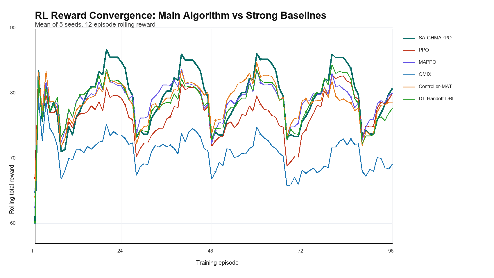
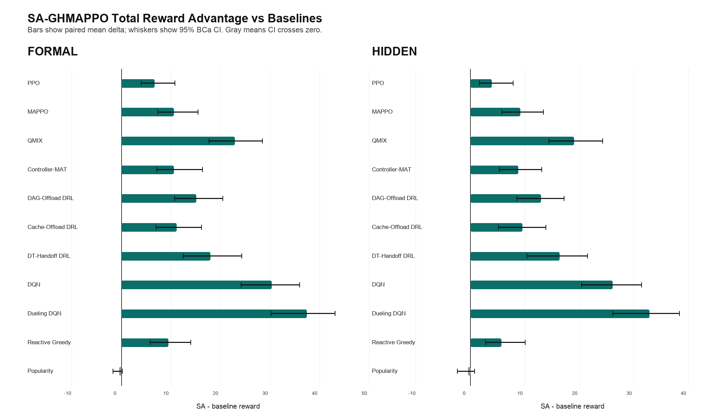
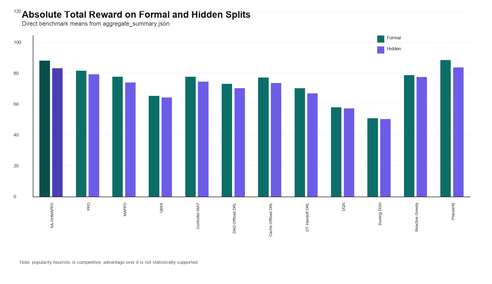
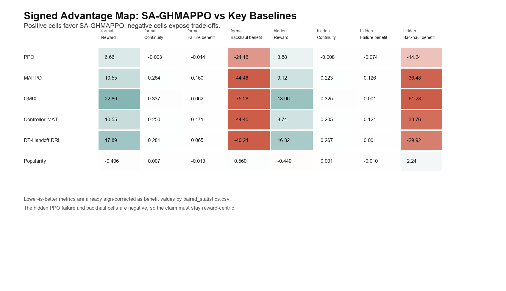

# SA-GHMAPPO RL 奖励收敛表与算法优势可视化

- reviewed_at: 2026-07-16
- artifact_run_id: strict_full_v8_dev_screen_20260621_v2 / strict_full_v8_formal_all_baselines_20260621_v1 / strict_full_v8_hidden_holdout_20260621_v1
- evidence_level: E2_ARTIFACT_AUDITED 派生可视化；不新增训练，不改变 canonical 结论
- policy_version: docs/project/top_journal_review_policy.md

## 1. 训练奖励收敛结论

主算法 SA-GHMAPPO 使用 5 个 seed、每个 seed 约 96 个训练 episode。前 12 个 episode 的平均 total_reward 为 76.302，末 12 个 episode 为 80.659，末段相对前段变化为 4.357，最佳 12-episode rolling mean 出现在 episode 20，值为 86.626。

这张图适合放在论文实验部分证明 RL 训练过程没有退化为随机搜索；但它仍然只是 dev-screen 训练曲线，不应替代 formal/hidden benchmark 的最终泛化证据。

## 2. 主算法对比其他算法的优势

在 formal split，SA-GHMAPPO 的绝对 total_reward 为 88.017；在 hidden split 为 83.026。相对 learned baselines 和 reactive greedy，formal split 有 10 个 baseline 的 95% BCa CI 完全大于 0，hidden split 有 10 个 baseline 的 95% BCa CI 完全大于 0。

## 3. Claim 边界

优势表必须按以下边界表述：SA-GHMAPPO 在 formal/hidden 的总奖励上优于 PPO、MAPPO、QMIX、Controller-MAT、DQN 系列以及专门机制 DRL baseline；但不能声称显著优于 popularity cache heuristic。

| split | mean_delta | ci95_low | ci95_high |
|---|---:|---:|---:|
| formal | -0.405700 | -1.710537 | 0.152826 |
| hidden | -0.449450 | -2.435498 | 0.721750 |

系统指标也存在 trade-off：部分 failure/backhaul 单元对 PPO 为负，因此论文主 claim 应写为“总奖励和连续性机制综合目标可行”，不能写成“所有系统指标全面最优”。

## 4. 生成文件

- `outputs/sa_ghmappo_reward_visuals_20260716/rl_training_episode_table.csv`: 统一后的每 episode 训练日志，含 agent/seed/source_file。
- `outputs/sa_ghmappo_reward_visuals_20260716/rl_reward_convergence_table.csv`: 每个算法每个 episode 的 5-seed mean/std/CI 与 12-episode rolling reward。
- `outputs/sa_ghmappo_reward_visuals_20260716/rl_reward_convergence_summary.csv`: 前 12、末 12、最佳 rolling reward 等收敛摘要。
- `outputs/sa_ghmappo_reward_visuals_20260716/benchmark_total_reward_advantage.csv`: formal/hidden total_reward paired delta 与 95% CI。
- `outputs/sa_ghmappo_reward_visuals_20260716/benchmark_signed_metric_advantage.csv`: reward、continuity、failure、backhaul 等 signed benefit 表。

## 5. 可写进论文的表述

在 NGSIM + Alibaba 的 strict-full v8 设置下，SA-GHMAPPO 的训练曲线在多 seed 上保持稳定，并在末段维持高于多数 learned baselines 的 reward 水平。formal 和 hidden benchmark 的 paired statistics 进一步显示，主算法在 total_reward 上相对 PPO/MAPPO/QMIX/Controller-MAT 以及三个专门机制 DRL baseline 均获得正向且 95% BCa CI 不跨 0 的增益。该结果支持本文方法在连续 DAG workflow、adapter cache 协同与 handoff 状态迁移联合控制问题上的可行性。不过，popularity cache heuristic 的 reward 差异 CI 跨 0，且 hidden PPO 对比下 failure/backhaul benefit 为负，因此论文结论应限定为 reward-centric feasibility and mechanism-aware improvement，而不是全指标统治性最优。
